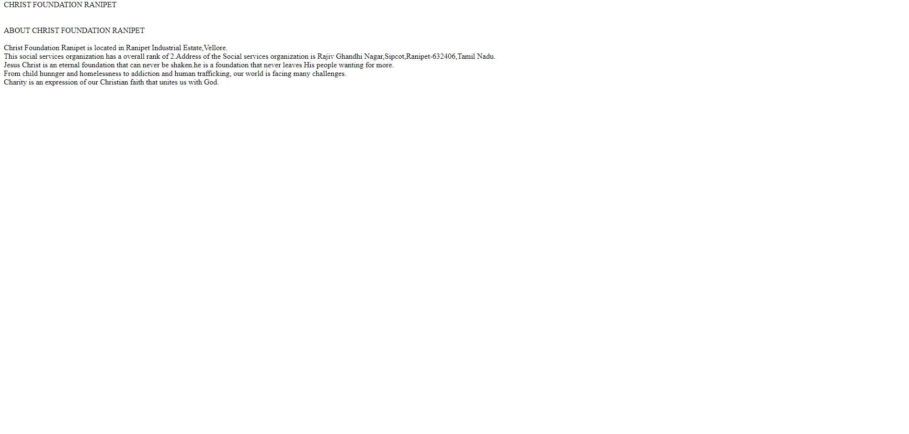
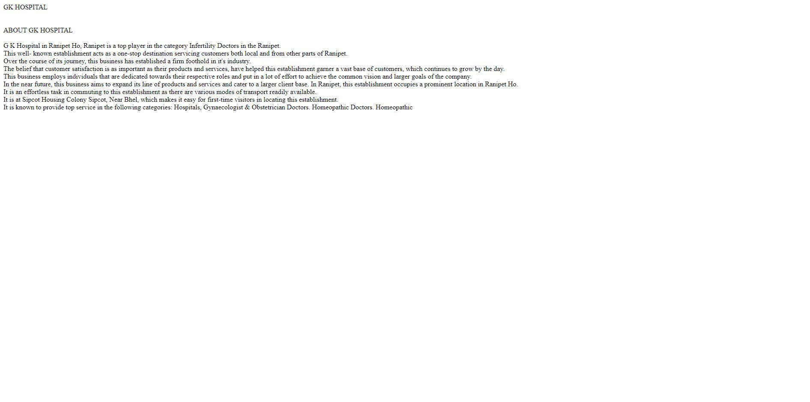
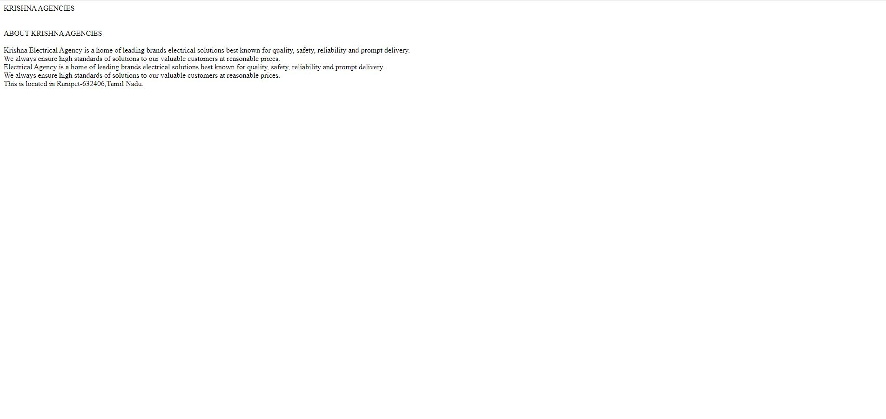
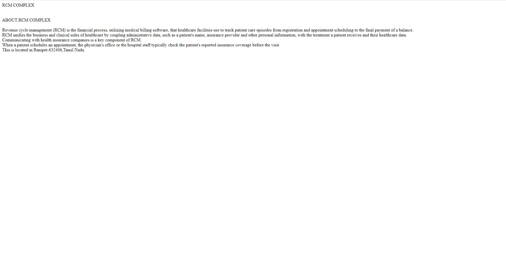
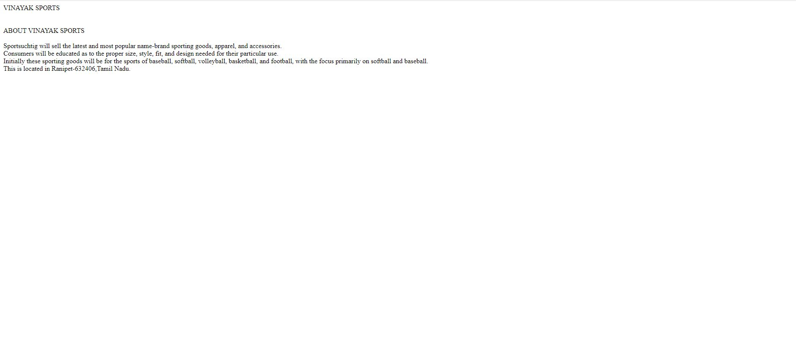

# Places Around Me
## AIM:
To develop a website to display details about the places around my house.

## Design Steps:

### Step 1:
creat your area location map.
### Step 2:
add content to any 5 places around your map.
### step 3:
complete the index work.

## Code:
```
html
<!DOCTYPE html>
<html>
    <head>
        <title>Places around me</title>
    </head>
    <body>
        
        <map name="image-maps-2023-07-24-034751" id="ImageMapsCom-image-maps-2023-07-24-034751">
        <area  alt="" title="ChristFoundationRanipet" href="ChristFoundationRanipet.html" shape="rect" coords="1823,394,1873,444" style="outline:none;" target="_self"     />
        <area  alt="" title="GKHospital" href="GKHospital.html" shape="rect" coords="1827,669,1877,719" style="outline:none;" target="_self"     />
        <area  alt="" title="RCMComplex" href="RCMComplex.html" shape="rect" coords="1061,165,1111,215" style="outline:none;" target="_self"     />
        <area  alt="" title="KrishnaAgencies" href="KrishnaAgencies.html" shape="rect" coords="1298,8,1348,58" style="outline:none;" target="_self"     />
        <area  alt="" title="Vinayaksports" href="Vinayaksports.html" shape="rect" coords="1591,247,1641,297" style="outline:none;" target="_self"     />
        <area shape="rect" coords="1898,794,1900,796" alt="Image Map" style="outline:none;" title="Image Map" href="https://www.image-maps.com/" />
</map>
</map>
         </map>
    </body>
</html>
```

## Output:

### CHRISTFOUNDATIONRANIPET:

### GKHOSPITAL:

### KRISHNAAGENCIES:

### RCMCOMPLEX:

### VINAYAKSPORTS



## Result:
The program was executed successfully.